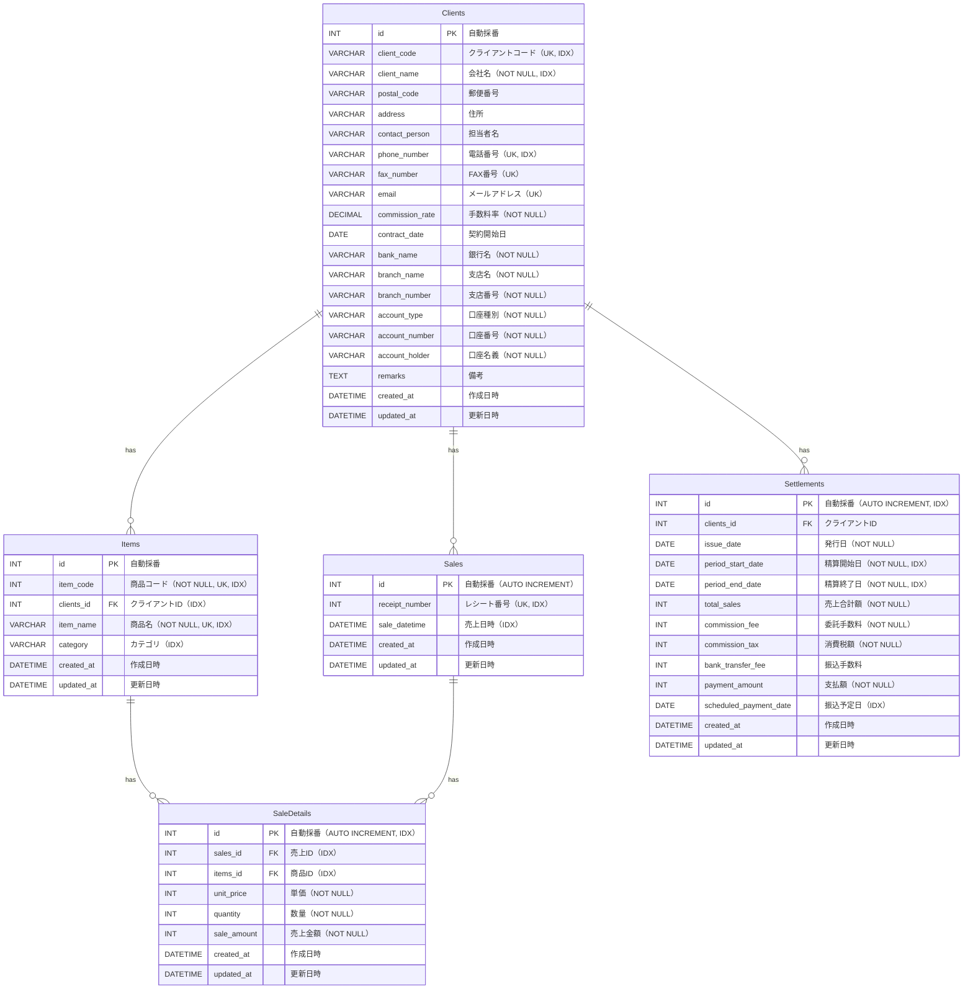

# ER図 - 精算システム

## テーブル一覧

1. **Clients（顧客）** - 顧客情報を格納
2. **Items（商品）** - 商品情報を格納
3. **Sales（売上）** - レシート番号、売上日時を格納
4. **SaleDetails（売上明細）** - 単価、数量、売上金額を格納
5. **Settlements（精算）** - 委託販売精算書に必要な項目を格納

## ER図（Mermaid形式）

## テーブル詳細

### 1. Clients（顧客テーブル）
- **主キー**: `id` (INT, 自動採番)
- **ユニークキー**: `client_code`, `phone_number`, `fax_number`, `email`
- **インデックス**: `id`, `client_code`, `client_name`, `phone_number`
- **説明**: 顧客情報を格納するテーブル。銀行口座情報も含む

### 2. Items（商品テーブル）
- **主キー**: `id` (INT, 自動採番)
- **外部キー**: `clients_id` → Clients.id
- **ユニークキー**: `item_code`, `item_name`
- **インデックス**: `item_code`, `clients_id`, `item_name`, `category`
- **説明**: 商品情報を格納。単価は変動する可能性があるため、売上明細テーブルへ格納

### 3. Sales（売上ヘッダテーブル）
- **主キー**: `id` (INT, 自動採番)
- **ユニークキー**: `receipt_number`
- **インデックス**: `receipt_number`, `sale_datetime`
- **説明**: レシート番号、売上日時を格納

### 4. SaleDetails（売上明細テーブル）
- **主キー**: `id` (INT, 自動採番)
- **外部キー**: 
  - `sales_id` → Sales.id
  - `items_id` → Items.id
- **インデックス**: `id`, `sales_id`, `items_id`
- **説明**: 単価、数量、売上金額を格納。売上時点での商品単価を保持

### 5. Settlements（委託販売精算テーブル）
- **主キー**: `id` (INT, 自動採番)
- **外部キー**: `clients_id` → Clients.id
- **インデックス**: `id`, `period_start_date`, `period_end_date`, `scheduled_payment_date`
- **説明**: 委託販売精算書に必要な項目を格納

## リレーションシップ

1. **Clients → Items**: 1対多（1つの顧客が複数の商品を持つ）
2. **Clients → Sales**: 1対多（1つの顧客が複数の売上を持つ）
3. **Clients → Settlements**: 1対多（1つの顧客が複数の精算を持つ）
4. **Items → SaleDetails**: 1対多（1つの商品が複数の売上明細に含まれる）
5. **Sales → SaleDetails**: 1対多（1つの売上が複数の明細を持つ）

